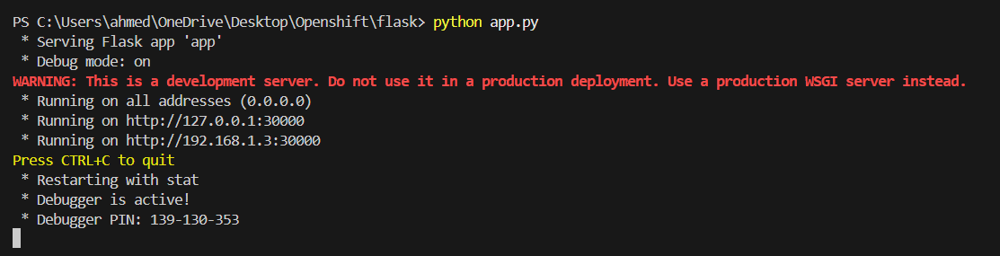
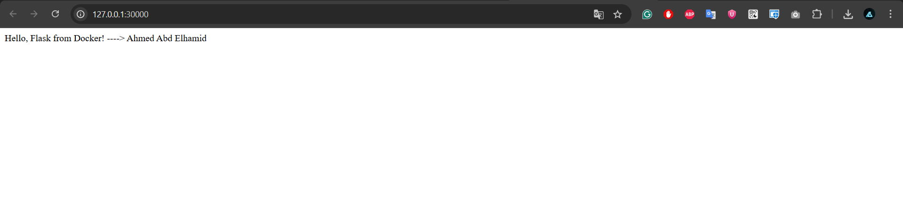
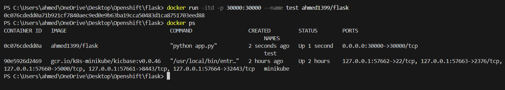
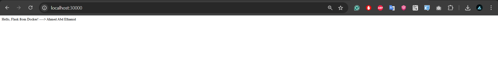

# Simple Flask App
```bash
I use Flask to build Simple App
# Install flask Local for testing
pip install flask
# Check Flask
flask --version
# Run app Locally
python app.py
```




# Prepare Docker Image
```bash
# Write your Docker file & Build Image from it
docker build -t ahmed1399/flask .
```

# Create Container use "zerosploit" Network
```bash
docker run -itd --name test -p 30000:30000 ahmed1399/flask
```

